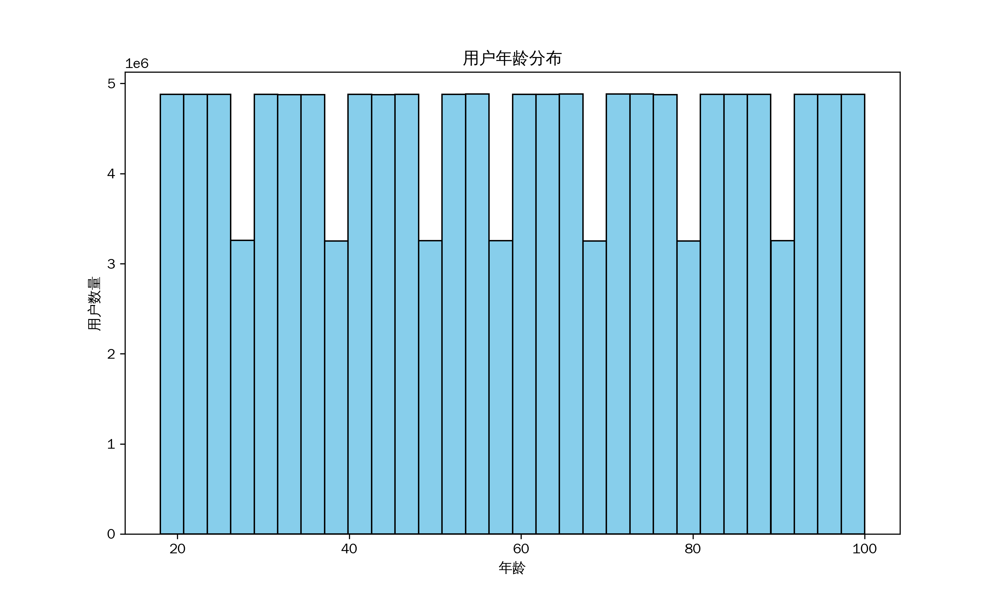
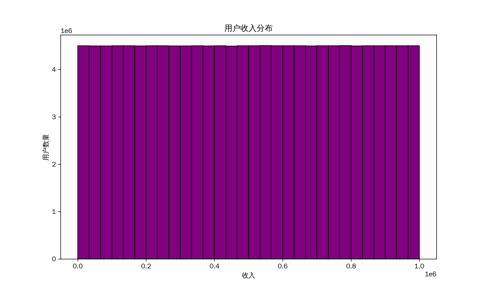
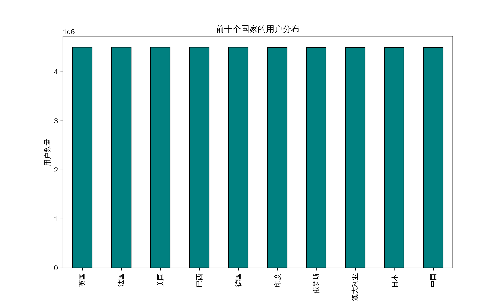
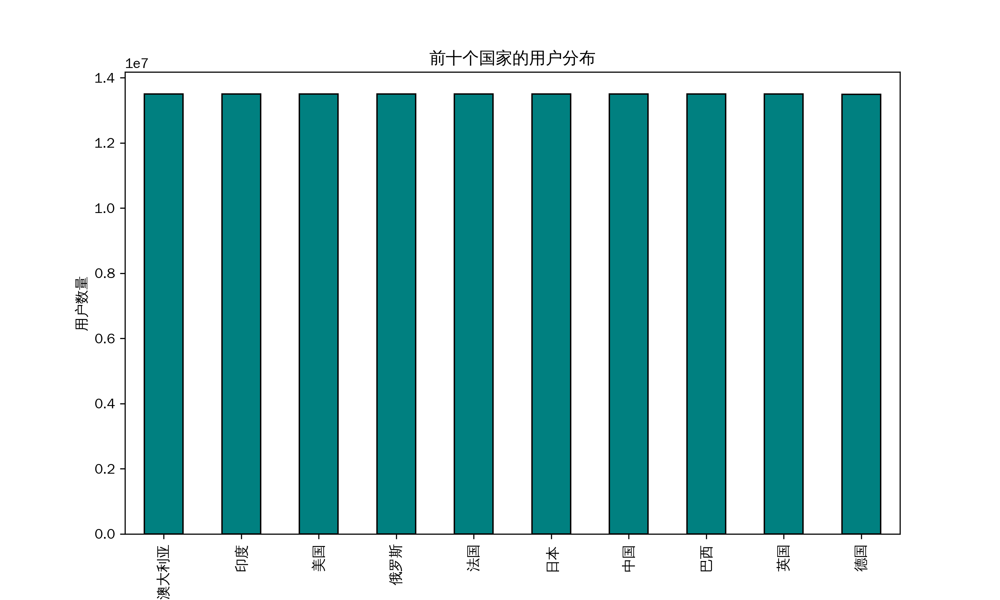

# 数据探索性分析与预处理——分析过程报告

## 1. 探索性分析和可视化
根据数据中所展现出来的内容，选择了年龄分布，收入分布和国家使用人数进行数据可视化。

### 1.1 年龄分布

<figure>
  
  <figcaption style="text-align:center; font-style:italic;">
    10G AGE DISTRIBUTION
  </figcaption>
</figure>

<figure>
  
  <figcaption style="text-align:center; font-style:italic;">
    30G AGE DISTRIBUTION
  </figcaption>
</figure>

可以从上面两图看出，可能因为数据是合成的缘故，用户年龄分布十分规律，较为反常。

### 1.2 收入分布
<figure>
  
  <figcaption style="text-align:center; font-style:italic;">
    10G INCOME DISTRIBUTION
  </figcaption>
</figure>

<figure>
  
  <figcaption style="text-align:center; font-style:italic;">
    30G INCOME DISTRIBUTION
  </figcaption>
</figure>

从上面两图可以看出，用户收入分布较为均匀，且收入整体来看都很高。

### 1.3 用户主要国家
<figure>
  
  <figcaption style="text-align:center; font-style:italic;">
    10G COUNTRY DISTRIBUTION
  </figcaption>
</figure>

<figure>
  
  <figcaption style="text-align:center; font-style:italic;">
    30G COUNTRY DISTRIBUTION
  </figcaption>
</figure>

从上面两图可以看出，用户主要来自澳大利亚，印度，美国，俄罗斯，法国，日本，中故宫，巴西，英国，德国等，且人数差距很小。

### 程序运行时间
10G数据：程序运行时间: 220.20 秒
30G数据：程序运行时间: 638.46 秒

## 2. 数据预处理
### 2.1 数据质量分析
使用DataWrangler大概预览数据，可以看到数据基本没有缺失值，但是地址有大量标记为Non chinese address placeholder的值，这可能是用户的地址在海外导致的。考虑到用户地址对于我们的分析基本不构成影响，我只将缺失地址的用户标记出来，而没有直接将他们删除。

### 2.2 缺失值和异常值分析
#### 2.2.1 缺失值分析
在results/preprocessing中可以看到我的分析结果。
##### 10G数据：
* [缺失值统计]
id                   0
last_login           0
user_name            0
fullname             0
email                0
age                  0
income               0
gender               0
country              0
address              0
purchase_history     0
is_active            0
registration_date    0
phone_number         0
login_history        0
dtype: int64

* 缺失值总数: 0, 缺失值占所有单元格的比例: 0.00%

* 删除包含缺失值的行后，剩余数据量: 45000000

##### 30G数据：
* [缺失值统计]
id                   0
last_login           0
user_name            0
fullname             0
email                0
age                  0
income               0
gender               0
country              0
address              0
purchase_history     0
is_active            0
registration_date    0
phone_number         0
login_history        0
dtype: int64
* 缺失值总数: 0, 缺失值占所有单元格的比例: 0.00%

* 删除包含缺失值的行后，剩余数据量: 135000000

#### 2.2.2 异常值分析
对于数值类型的值，基于统计学中常见的IQR准则（1.5倍IQR范围外的值视为异常）进行异常检测。同时检测缺乏中文地址的用户。

##### 10G数据
* [异常值统计]
异常值行数: 0, 占当前数据比例: 0.00%

* 删除异常值后，剩余数据量: 45000000

* [地址统计]
* 包含'Non-Chinese Address Placeholder'的行数: 9003537，占比: 20.01%

##### 30G数据
* [异常值统计]
异常值行数: 0, 占当前数据比例: 0.00%

* 删除异常值后，剩余数据量: 135000000

* [地址统计]
* 包含'Non-Chinese Address Placeholder'的行数: 26996121
占比: 20.00%

#### 2.2.3 程序运行时间：
10G数据：程序运行时间: 297.43秒
30G数据：程序运行时间: 345.18秒

## 3. 识别高价值目标
启发式地认为年龄大于25岁且收入大于500000，或者购买商品平均价格大于5000的用户为高价值目标，

### 3.1 10G数据
* 潜在高价值用户数量: 32673739
* 程序执行时间: 1983.76秒

### 3.2 30G数据
* 潜在高价值用户数量:暂未获取
* 程序执行时间:暂未获取
