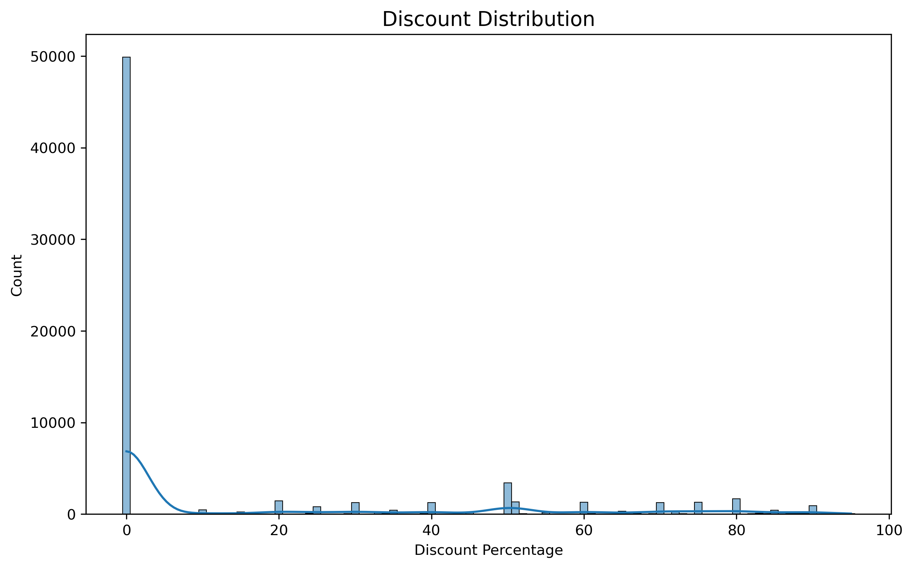
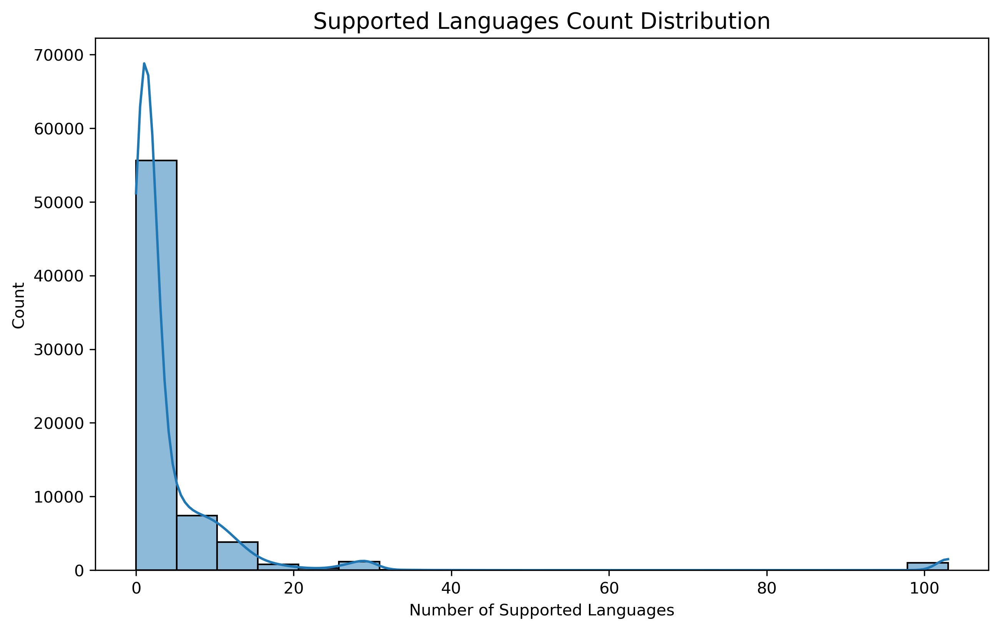
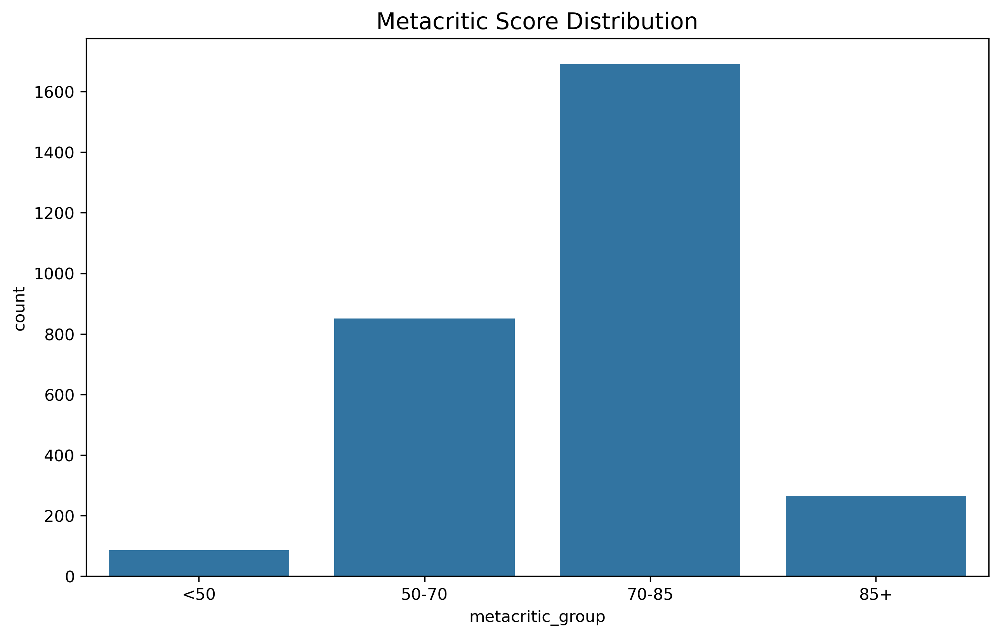
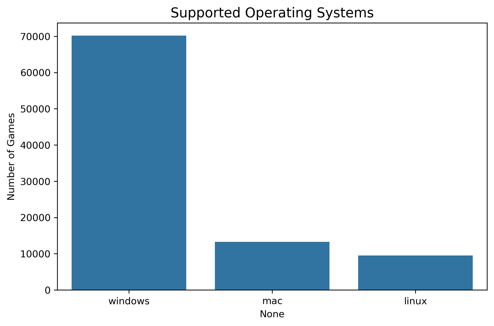
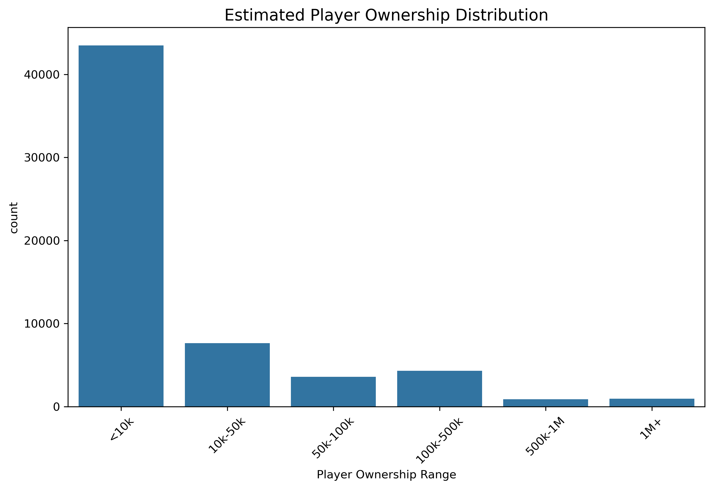
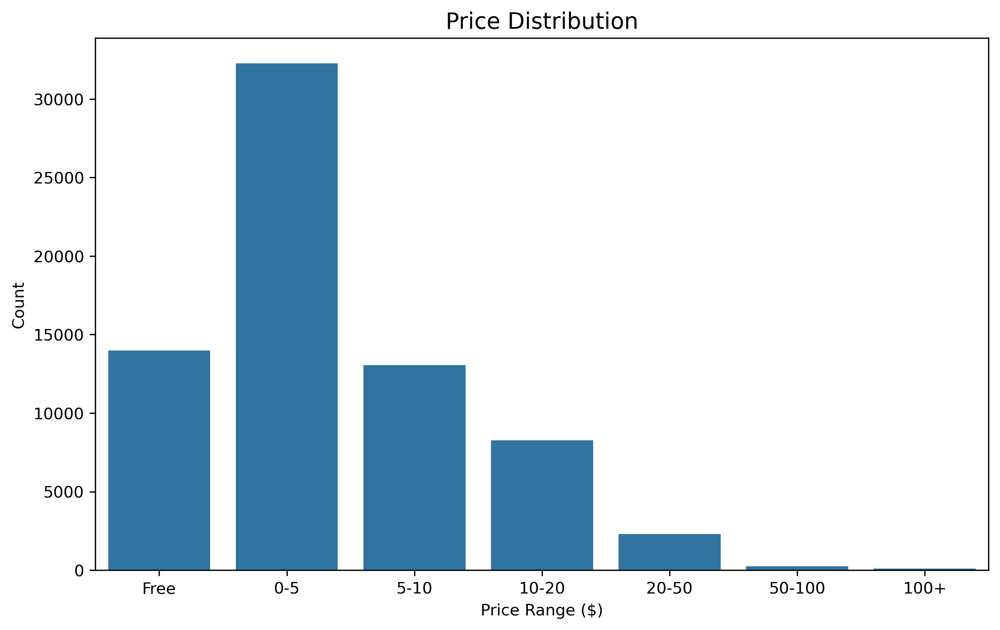
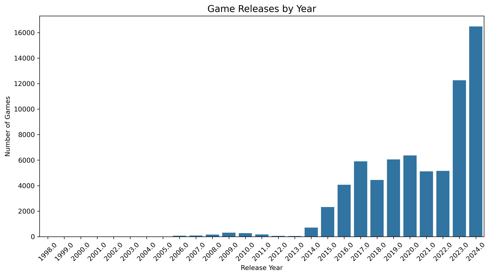
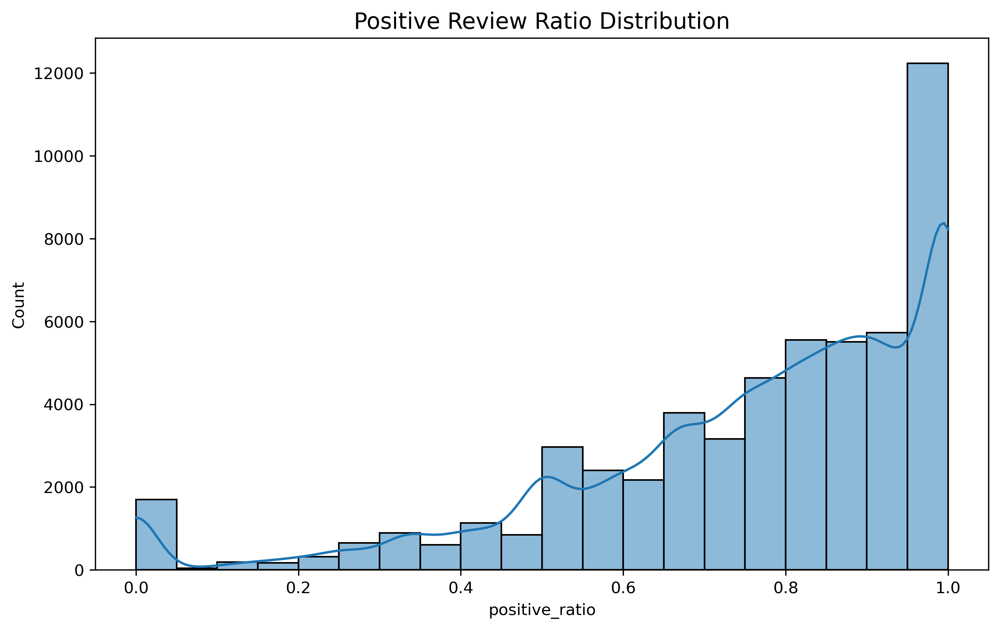
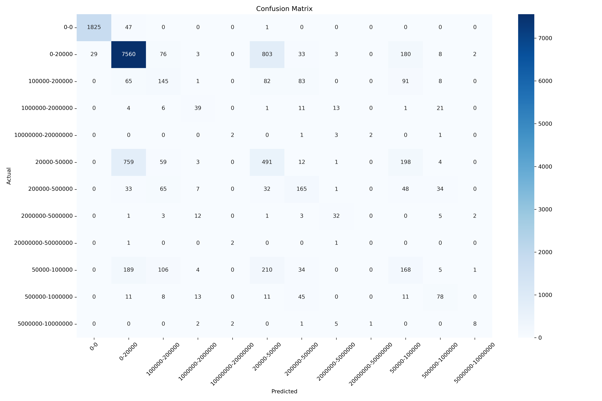
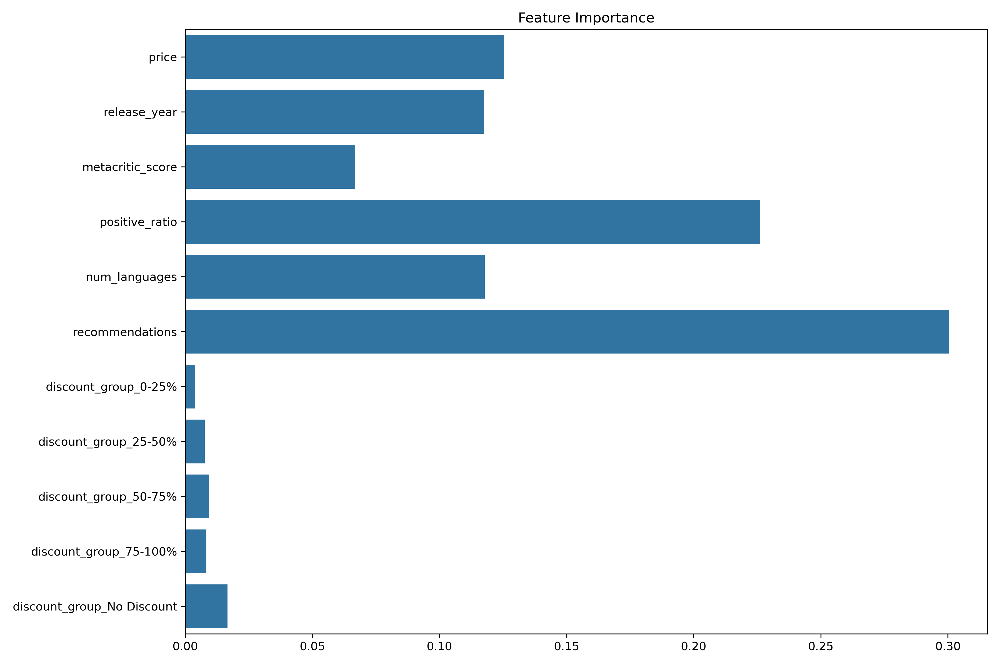

## [Steam游戏销量预测项目]

- 报告日期: 4.23
- 报告人：赵一鸣
- 时间：4.1 至 4.23

### 一、项目进展概述

4.1-4.7: 进行题目确定，开题报告编写，数据获取和分析思路的制定。
4.8-4.14: 进行数据清洗和数据特征分析。
4.15-4.22: 进行预测算法的探索与初步实现。

### 二、详细进展报告

#### 1. 数据准备阶段

- **完成情况**：完成百分比：100%
- **已完成工作**：
	- 获取steam游戏数据，steam评价数据（from kaggle）
	- 数据质量较好，没有数值型的缺失值，字符串型的缺失值大部分不影响分析，也难以补充。
	
- **遇到的问题**：
	- steam评价数据过大，难以进行质量的评估（大量评价并不真实反馈玩家的真实评价）
- **解决方案**：
	- 尽可能启发式地清洗一下

#### 2. 初步分析阶段

- **完成情况**：完成百分比：100%
- **已完成工作**：
	- 数据分布：
	
	
	
	
	
	
	
	
	
- **调整方向**：
  - 继续探索游戏销量与上述维度之间的关系

#### 3. 方法实现阶段

- **完成情况**：完成百分比：50%
- **已实现的技术**：
	- **已测试模型**：
		- 尝试使用随机森林算法
	- **模型调优**：
		- 超参数：classifier__max_depth': 20, 'classifier__min_samples_split': 2, 'classifier__n_estimators': 200

- **性能评估**：
	- 做回归效果不好（数据特性决定）
	- 分类：
	模型准确率：74.89%
	
	
- **技术挑战**：
	- 真实数据获取/数据合成
	- 其他模型的使用

### 三、时间规划执行情况

| 阶段     | 计划时间 | 实际时间 | 偏差   | 状态                 |
| -------- | -------- | -------- | ------ | -------------------- |
| 数据准备 | [一周]   | [一周]   | [无] | [已完成] |
| 初步分析 | [一周]   | [一周]   | [无] | [已完成] |
| 方法实现 | [两周]   | [进行中]   | [无] | [进行中] |
| 结果评估 | [一周]   | [实际]   | [差异] | [进行中/已完成/延迟] |
| 应用开发 | [一周]   | [实际]   | [差异] | [进行中/已完成/延迟] |
| 系统测试 | [一周]   | [实际]   | [差异] | [进行中/已完成/延迟] |
| 部署准备 | [一周]   | [实际]   | [差异] | [进行中/已完成/延迟] |

### 四、下一阶段重点工作

- **数据方面**：
	- estimated_owners的数值化（爬取/数据增强）
	- 爬取2024年新发布游戏的信息进行验证
- **算法方面**：
	- 尝试其他分类方法，或者在有数值型数据后进行回归算法
- **应用开发**：
	- 界面或API的开发
	- 系统集成工作